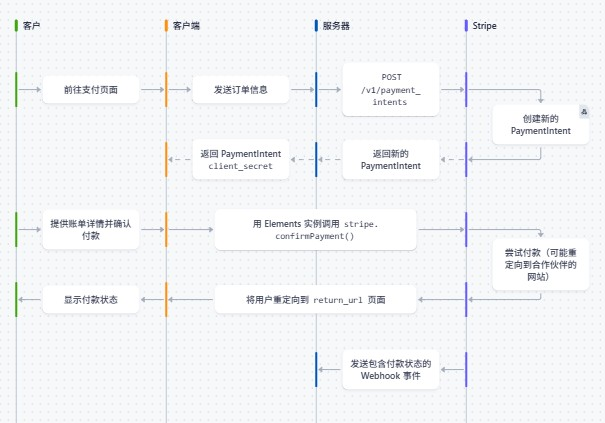
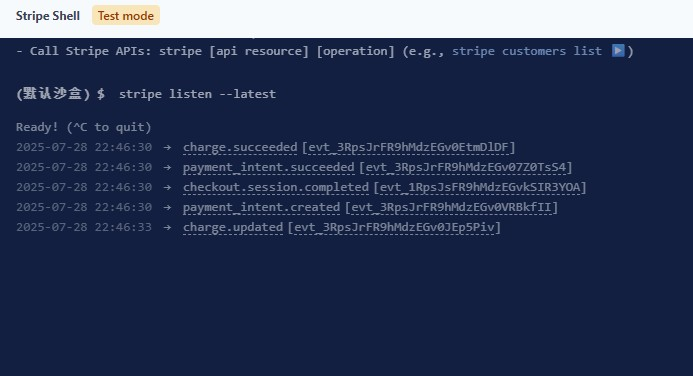

# stripe-app

接入Stripe支付

Stripe官方文档 https://docs.stripe.com/payments/quickstart

## 大致流程

1. 客户端创建支付意图(Create a Payment Intent) 获取用户支付方式
2. 从客户那里获取信用卡信息(Collect Card Details) 或者其他信息
3. Send it to Stripe 调用Stripe confirm card payment 将数据发到Stripe的服务器
4. Stripe向你提供的webhook发送消息，让你给客户发货



## 定价策略

最好的定价策略是客户们喜欢的定价策略。

1. 免费增值模式(Freemium)

有一个免费层，至少在付费之前免费试用一段时间，部分功能高级订阅才开放，基础功能免费使用

2. 免费试用(Free Trial)

免费试用一定的天数，或者一定免费额度，容易被滥用。

3. 一次性付费(One-Time Payment)

一次性付较高额费用，永久免费。

4. 分层订阅(Tiered Subscriptions)

例如分为 Beginner、Professional、Enterprise 三档，每档比前一档更强。非常常见的策略。

5. 座位基础定价(Seat-Base Pricing)

B2B常见较为常见，企业通常为多个员工购买服务，例如为每个员工购买企业IM账号服务。

6. 按使用计费(Metered Billing)

代币或积分的方式，本质是平台的余额。

## 三个密钥

1. SCRIPE_PUBLISHABLE_KEY: 这个密钥用于前端访问Stripe、可以安全地在前端代码中公开
2. STRIPE_SECRET_KEY: 用于后端访问Stripe、绝对不能在暴露给他人
3. STRIPE_WEBHOOK_SECRET: 用于验证webhook请求是否真的来自stripe、同样不能暴露给他人

写到.env中千万不要提交到git仓库中

## 服务端接入

创建stripe实例

```js
const Stripe = require('stripe')
const stripe = new Stripe(process.env.STRIPE_SECRET_KEY);
```

试用checkout

```js
require('dotenv').config();
const express = require('express');
const cors = require('cors');
const Stripe = require('stripe')

const stripe = new Stripe(process.env.STRIPE_SECRET_KEY);

const app = express();
const PORT = process.env.PORT || 3001;

app.use(cors());
app.use(express.json());

// 在Stripe设置好产品，然后就会有一个PriceID
app.get('/checkout', async (req, res) => {
    try {
        const session = await stripe.checkout.sessions.create({
            payment_method_types: ['card'],
            line_items: [
                {
                    price: 'price_1RprHDFR9hMdzEGvV5rvfjlJ',
                    quantity: 1
                },
            ],
            mode: 'payment',
            // 客户支付成功后跳转地URL
            success_url: 'http://localhost:3000/success',
            // 客户取消支付后跳转地URL
            cancel_url: 'http://localhost:3000/cancel',
        });
        return res.status(200).json(session);
    } catch (error) {
        res.status(500).json({ error: error.message });
    }
});
```

前端请求后端地/checkout,将返回一个如下面格式的json，客户端访问下面地那个stripe提供的url，可以进到支付界面。

```json
{
  "id": "cs_test_a13TFuEX4xEpgRz6VIMsiA0Fc0z6tdEoK1aP5U5pHEretkaKakrHOk3lbZ",
  "object": "checkout.session",
  "adaptive_pricing": {
    "enabled": true
  },
  "after_expiration": null,
  "allow_promotion_codes": null,
  "amount_subtotal": 10000,
  "amount_total": 10000,
  "automatic_tax": {
    "enabled": false,
    "liability": null,
    "provider": null,
    "status": null
  },
  "billing_address_collection": null,
  "cancel_url": "http://localhost:3000/cancel",
  "client_reference_id": null,
  "client_secret": null,
  "collected_information": null,
  "consent": null,
  "consent_collection": null,
  "created": 1753710431,
  "currency": "hkd",
  "currency_conversion": null,
  "custom_fields": [],
  "custom_text": {
    "after_submit": null,
    "shipping_address": null,
    "submit": null,
    "terms_of_service_acceptance": null
  },
  "customer": null,
  "customer_creation": "if_required",
  "customer_details": null,
  "customer_email": null,
  "discounts": [],
  "expires_at": 1753796831,
  "invoice": null,
  "invoice_creation": {
    "enabled": false,
    "invoice_data": {
      "account_tax_ids": null,
      "custom_fields": null,
      "description": null,
      "footer": null,
      "issuer": null,
      "metadata": {

      },
      "rendering_options": null
    }
  },
  "livemode": false,
  "locale": null,
  "metadata": {

  },
  "mode": "payment",
  "origin_context": null,
  "payment_intent": null,
  "payment_link": null,
  "payment_method_collection": "if_required",
  "payment_method_configuration_details": null,
  "payment_method_options": {
    "card": {
      "request_three_d_secure": "automatic"
    }
  },
  "payment_method_types": [
    "card"
  ],
  "payment_status": "unpaid",
  "permissions": null,
  "phone_number_collection": {
    "enabled": false
  },
  "recovered_from": null,
  "saved_payment_method_options": null,
  "setup_intent": null,
  "shipping_address_collection": null,
  "shipping_cost": null,
  "shipping_options": [],
  "status": "open",
  "submit_type": null,
  "subscription": null,
  "success_url": "http://localhost:3000/success",
  "total_details": {
    "amount_discount": 0,
    "amount_shipping": 0,
    "amount_tax": 0
  },
  "ui_mode": "hosted",
  "url": "https://checkout.stripe.com/c/pay/cs_test_a13TFuEX4xEpgRz6VIMsiA0Fc0z6tdEoK1aP5U5pHEretkaKakrHOk3lbZ#fidkdWxOYHwnPyd1blpxYHZxWjA0VHQ8PVdDVzxtSGF%2FQEJzPGo2V09zNE5OVm5Ia0tCU0lhPDJRfU4zQ2BTRGRGRmdAbkJrMH9EVlVqQGI8N0I8MmdTR3FzNkh0XWpEdV9wVmNhMVVJbzV1NTVxaWJ8M0lUVycpJ2N3amhWYHdzYHcnP3F3cGApJ2lkfGpwcVF8dWAnPyd2bGtiaWBabHFgaCcpJ2BrZGdpYFVpZGZgbWppYWB3dic%2FcXdwYHgl",
  "wallet_options": null
}
```

https://docs.stripe.com/testing?locale=zh-CN Stripe提供了许多可以模拟支付的银行卡号。

支付成功则跳到我们指定的 success_url、点返回则跳到我们指定的cancel_url。

## stripe-cli

在Stripe有各种不同的事件、可能会在后台发生，比如支付可能会被退款，订阅可能会被取消，或者在这个案例中结账会话完成了。

当事件发生时，stripe会通过webhook向您的服务器发送请求。这样你就可以获取事件相关数据并做一些操作。

为了在本地测试webhook，你需要安装 Stripe Cli,它允许向本地代码发送模拟请求。以便在实际部署到生产环境之前，进行测试。

https://docs.stripe.com/stripe-cli#install

可以在线试用 stripe listen --latest

```bash
# 通过stripecli登录stripe账号
stripe login
# 监听stripe事件转发到我们的服务器
stripe listen -e customer.subscription.updated,customer.subscription.deleted,checkout.session.completed --forward-to http://mfavant.xyz:3001/webhook
# 然后会给你一个 Webhook Secret
```



可以进行一个checkout支付，到成功出发了哪些事件。

## Webhook

验证webhook，需要验证他们确实来自stripe，通过Webhook Secret验证。


